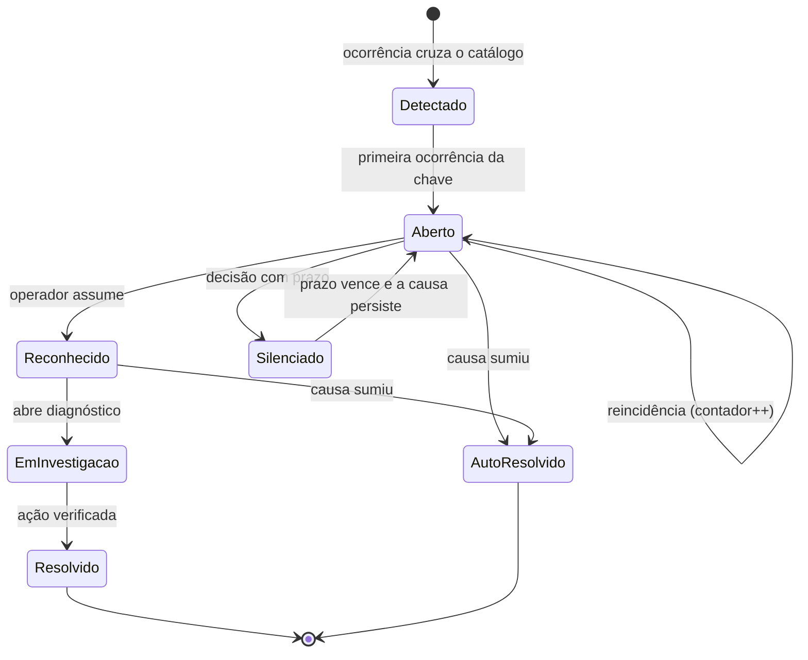

# SPEC do P0 — Tráfego como Operação

**Estado:** ✅ **aprovado e congelado** · **Data:** 24/08/2026
**Porta de entrada:** [TRAFEGO.md](./TRAFEGO.md) · **Fatos:** [ledger](./EVIDENCIAS-TRAFEGO.md) · **Decisões:** [ADRs](./ADR-TRAFEGO.md) · **Par:** [PRD](./PRD-TRAFEGO-OPERACAO.md)

> **Marcação:** **[F]** fato (com `E-nn`) · **[I]** inferência · **[DA]** decisão aceita ·
> **[DP]** decisão pendente · **[R]** risco · **[DE]** dependência externa.
> Este documento supera a §4.1 do [SPEC do Hub](./SPEC-HUB-DE-TRAFEGO.md); o restante daquele
> spec continua vigente para o **nascimento** da campanha.

---

## 1. Mapa de domínio

### 1.1 Os agregados

```
CONTA DE ANÚNCIO ──1:N──► CAMPANHA (volcCampaignId) ──1:1──► VÍNCULO ──N:1──► FUNIL ──► OPORTUNIDADE
     (externa)                    │                          (auditável,      (Redator)   (Pautador)
                                  │                           reversível)
                                  └──N:1──► LINHAGEM (campaignLineageId)
                                            testes · relançamentos · substituições

CAMPANHA ──1:N──► EVENTO OPERACIONAL ──[P1]──► OCORRÊNCIA ──► INCIDENTE ──► RECONHECIMENTO
                       (P0)                                                        │
                                                                    PROPOSTA ──► EXECUÇÃO/RECIBO ──► RESOLUÇÃO
```

### 1.2 Identidade — instância e linhagem

**[DA]** Duas identidades internas, com papéis distintos (ADR-02):

| identidade | granularidade | papel | estabilidade |
|---|---|---|---|
| `volcCampaignId` | **1:1 com uma campanha externa** | endereço, auditoria, recibo | nunca muda |
| `campaignLineageId` | **1:N sobre instâncias** | intenção operacional: testes, relançamentos, substituições | nunca muda |

A identidade **externa** permanece o par `(customer_id, campaign_id)`.

**Por que duas.** **[F]** A FGTS gerou três campanhas externas numa noite e a Maquininha,
duas ([E-05](./EVIDENCIAS-TRAFEGO.md#e-05)). Uma identidade só não consegue ser simultaneamente estável por instância — o
que a auditoria e o recibo exigem — e agregadora por intenção — o que o histórico e a
prevenção de duplicidade exigem.

**Rotas.**

```
/trafego/campanhas/:volcCampaignId        ← canônica, uma instância
/trafego/linhagens/:campaignLineageId     ← histórico da intenção   [DP: só se ganhar uso]
/dashboard/campaign/:campaignId           ← compatibilidade, redireciona
```

**[R]** `campaignId` legado ambíguo leva a escolha explícita, nunca a palpite.
**[DP]** Como a linhagem é atribuída — recomendação: **declarada no lançamento**, com
inferência apenas como sugestão.

### 1.3 Estados de presença

**[DA]** Seis estados (ADR-13). O rótulo `sumiu da conta` está retirado por fundir causas
distintas e afirmar um fato que a varredura não prova.

`removida` · `não encontrada` · `conta não identificada` · `fora de escopo` ·
`sincronização falhou` · `legado não reconciliado`

**[DA]** As três linhas de fevereiro nascem como **`legado não reconciliado`**. **[F]** Elas
têm `customer_id` vazio ([E-02](./EVIDENCIAS-TRAFEGO.md#e-02)): não sabemos em que conta procurá-las, então declarar
ausência seria inventar medição.

### 1.4 Os sete conceitos de sinal

| conceito | pergunta | dono de escrita | onda |
|---|---|---|---|
| **Sinal** | "que condição sei observar?" | catálogo versionado | P1 |
| **Evento operacional** | "o que aconteceu, sem perder?" | produtor | **P0** |
| **Ocorrência** | "o que medi neste instante?" | detector | P1 (promove o evento) |
| **Incidente** | "que condição dura, desde quando?" | agregador | P1 |
| **Reconhecimento** | "quem assumiu?" | operador | P1 |
| **Proposta** | "o que fazer?" | motor ou humano | P2 |
| **Execução/Recibo** | "o que foi enviado e o que voltou?" | Executor | P2 |
| **Resolução** | "por que fechou?" | agregador ou operador | P1 |

**[DA] O P0 entrega só o evento operacional** (ADR-14): append-only, com carimbo, tipo,
chave de agrupamento **opaca**, sujeito e carga. A promoção a Ocorrência no P1 é **aditiva**,
não migração.

**[DA] A notificação é projeção**, não entidade: o sino consulta, não guarda.

---

## 2. Matriz de autoridade das fontes

| estado | autoridade | dono de escrita | papel do banco | evidência |
|---|---|---|---|---|
| campanha existe | **Google Ads** | sincronizador | espelho | [E-01](./EVIDENCIAS-TRAFEGO.md#e-01), [E-02](./EVIDENCIAS-TRAFEGO.md#e-02) |
| status, lance, verba | **Google Ads** | sincronizador | espelho | [E-01](./EVIDENCIAS-TRAFEGO.md#e-01), [E-14](./EVIDENCIAS-TRAFEGO.md#e-14) |
| aprovação de política | **Google Ads** | sincronizador | espelho | — |
| entrega (impressões, cliques, custo) | **Google Ads** | sincronizador | espelho com carimbo | [E-01](./EVIDENCIAS-TRAFEGO.md#e-01) |
| **identidade e linhagem** | **VOLC O.S.** | domínio | **verdade** | novo |
| **vínculo campanha↔funil** | **VOLC O.S.** | reconciliador (ato humano) | **verdade** | [E-03](./EVIDENCIAS-TRAFEGO.md#e-03), [E-16](./EVIDENCIAS-TRAFEGO.md#e-16) |
| **procedência do cadastro** | **VOLC O.S.** | porta de criação | **verdade** | **[F]** hoje derivada pelo banco — [E-08](./EVIDENCIAS-TRAFEGO.md#e-08), ADR-10 |
| **evento operacional** | **VOLC O.S.** | produtor | **verdade** | não existe hoje ([E-06](./EVIDENCIAS-TRAFEGO.md#e-06)) |
| receita, RPC, margem | GAM/AdSense/JoinAds | ingestão | espelho | fora do P0 |

**Regra derivada.** Onde o banco é espelho, **divergência é informação**, não erro: o
inventário mostra, não escolhe um lado.

---

## 3. SPEC funcional

### 3.1 P0-T · Inventário

Ao abrir `/trafego`, a aba padrão lista as campanhas conhecidas, agrupadas por conta, lidas
do **snapshot** — nunca da API.

Cada linha traz: nome, estado externo, estratégia, lance, verba, teto de cliques
(verba ÷ lance), entrega do período, estado do vínculo, estado de presença (§1.3) e **idade
do dado**.

Selos de procedência: `registrada` · `sem procedência` · `sem vínculo`.

**[DA]** Campanha ausente da varredura **não é apagada** — recebe o estado de presença
correspondente. **[DA]** Campanhas de teste permanecem pausadas (ADR-12).

**Aceite.** As duas campanhas aparecem com dado da conta e idade visível; as três de
fevereiro aparecem como `legado não reconciliado`; nenhuma consulta GAQL é disparada pelo
carregamento.

### 3.2 P0-R · Reconciliação

O sistema **sugere**; o operador **confirma**.

Regras de sugestão, em ordem: URL final igual à `lp_url` de um funil · URL final entre as
páginas publicadas · slug em comum. **Cada sugestão declara qual regra casou** — sugestão
sem regra visível não é oferecida.

**[F]** No caso da FGTS a primeira regra casa ([E-01](./EVIDENCIAS-TRAFEGO.md#e-01), [E-03](./EVIDENCIAS-TRAFEGO.md#e-03)).

**[DA]** Confirmação humana obrigatória; o vínculo registra quem, quando, regra, evidência e
vínculo anterior. Desvincular é operação de primeira classe (ADR-09).

### 3.3 P0-D · Prevenção de duplicidade, por composição

**[DA]** Antes de subir, prova **somente leitura na conta real**. Roda **sempre**, inclusive
sem vínculo de funil — é justamente o caso em que a duplicidade passa hoje ([E-04](./EVIDENCIAS-TRAFEGO.md#e-04)).

**Sinais e pesos** (ADR-03):

| sinal | peso |
|---|---|
| mesma conta | **pré-requisito** |
| mesma URL final | forte |
| mesmo canal | forte |
| mesma linhagem | forte |
| interseção alta de keywords exatas | forte |
| mesma segmentação (geo, idioma, rede) | médio |
| mesmo slug na taxonomia do nome | médio |

**Veredito:**

| resultado | condição |
|---|---|
| **bloqueio** | mesma conta **e** ≥ 2 sinais fortes, com a existente não removida |
| **advertência + confirmação** | mesma conta e 1 sinal forte — **inclusive URL final idêntica sozinha** |
| **segue** | nenhum sinal forte |

**[DA] URL idêntica sozinha não bloqueia.** Uma mesma página pode receber legitimamente
campanhas de canais diferentes, ou uma substituição planejada.

**[DA]** Relançar continua legítimo em qualquer veredito — **[F]** aconteceu cinco vezes com
motivo declarado ([E-05](./EVIDENCIAS-TRAFEGO.md#e-05)). A prova não proíbe; obriga a declarar o porquê.

**Aceite.** Tentar subir a FGTS a partir do cartão do funil dispara a prova, encontra a
campanha viva por URL + canal (dois sinais fortes) e **bloqueia** com a evidência nomeada —
mesmo sem vínculo gravado. Um caso de URL igual e canal diferente resulta em **advertência**,
não bloqueio.

### 3.4 P0-F · Frescor e degradação

| situação | como aparece |
|---|---|
| snapshot recente | dado + "lido há N min" |
| snapshot velho | dado + idade destacada |
| varredura falhou | `sincronização falhou`, com a hora da última leitura boa |
| nunca lida | "ainda não lido", sem números |

**[F]** Hoje três contas falhando é visualmente idêntico a "tudo bem" ([E-07](./EVIDENCIAS-TRAFEGO.md#e-07)).
**[DA]** Atualização manual limitada: escopo de uma conta, com frequência limitada e custo declarado.

---

## 4. SPEC técnica

### 4.1 Onde cada responsabilidade roda

| responsabilidade | onde | justificativa |
|---|---|---|
| varredura da conta | **backend, agendada** | tira 2,4 s + ~17 GAQL do render ([E-07](./EVIDENCIAS-TRAFEGO.md#e-07)) |
| snapshot + carimbo | **Postgres** | leitura instantânea e tolerante a falha externa |
| identidade, linhagem, vínculo | **backend (domínio)** | é verdade do VOLC, não espelho |
| prova de duplicidade | **backend**, sobre `volc_ads` | reusa a leitura da conta que já existe |
| evento operacional | **Postgres** | append-only, promovível (ADR-14) |
| projeção do sino | **frontend**, sobre o que existir | consulta barata |
| scheduler e adaptadores externos | **n8n permitido** | §4.3 |

### 4.2 Contratos internos (forma, não implementação)

| contrato | natureza | quem chama |
|---|---|---|
| sincronizar conta | comando idempotente por (conta, janela) | scheduler interno ou n8n |
| listar inventário | leitura do snapshot | tela |
| sugerir vínculos | leitura | tela |
| confirmar / desfazer vínculo | comando auditado | operador |
| provar equivalência | **leitura da conta real**, sem escrita | porta de criação |
| registrar evento operacional | append-only | qualquer produtor do núcleo |

Todos autenticados. **Nenhum contrato de escrita é exposto sem autenticação** — é a regra
que o P0-S existe para restaurar no perímetro legado.

### 4.3 Fronteira do n8n

| zona | permitido | proibido |
|---|---|---|
| **Núcleo** (VOLC O.S.) | políticas, autorização, estado de domínio, mutação de conta | — |
| **Periferia — scheduler** | disparar contrato interno autenticado | conter lógica de decisão |
| **Periferia — adaptador** | falar com fonte externa e entregar por contrato interno | escrever tabela de domínio direto |
| **Proibido** | — | superfície pública sem autenticação; mutar conta fora do Executor; segundo dono de escrita |

### 4.4 Custo da varredura

**[F]** Descoberta 2,4 s; três contas da casa; ~5 GAQL seriais por conta ([E-07](./EVIDENCIAS-TRAFEGO.md#e-07), [E-13](./EVIDENCIAS-TRAFEGO.md#e-13)).
**[I]** Com sincronização a cada 15 min, o custo fica na ordem de ~1.600 consultas/dia —
**constante**, em vez de proporcional à navegação. **[R]** cresce com o número de campanhas;
reavaliar a partir de ~50.

---

## 5. Matriz de reutilização do cockpit existente

**[DA]** O cockpit é capacidade preservada (ADR-07). A tela permanece; a fonte muda; a rota
canônica passa a ser interna com redirecionamento.

| componente | preservar | ação | fonte alvo |
|---|---|---|---|
| `OrientacaoBox` | sim | manter a superfície; passa a ler Proposta | Proposta (P2) |
| `OtimizacaoBox` | sim | manter; passa a ler Execução/Recibo | Execução (P2) |
| `BiddingActionBox` | **tela sim, caminho não** | **[F]** hoje faz POST direto do browser para webhook sem autenticação; o caminho sai, a caixa fica | Proposta → Executor |
| `DisplayROITable` | sim | manter | ingestão futura |
| `PlacementNegationCard` | sim | manter como superfície de atuação de Display | Proposta (P2) |
| `FunnelUrlsEditor` | sim | passa a ser **preenchido** pela reconciliação, não digitado | vínculo (P0-R) |
| `DataStatus` | **sim, e promover** | já lê frescor — é a semente do carimbo | snapshot |
| `DateFilter` | sim | manter | — |
| gráficos e KPIs de compra e de venda | sim | manter | snapshot + ingestão futura |
| `currencyUtils`, `taxHistoryService`, `roasCalculations` | **sim — regra de negócio** | preservar integralmente | — |

Fonte do inventário de componentes: [E-17](./EVIDENCIAS-TRAFEGO.md#e-17).

**O que o cockpit ganha:** cabeçalho com estado real da conta; diagnóstico de entrega;
veredito de política; histórico de alterações (quem mexeu, por qual cliente); estado do
vínculo; selo de procedência; estado de presença.

**[R]** O cockpit lê `daily_campaign_metrics` ([E-20](./EVIDENCIAS-TRAFEGO.md#e-20)), cuja autoridade não está resolvida.

---

## 6. Arquitetura de informação e wireframes

```
/trafego
   ├── campanhas      ← inventário (padrão)
   ├── oportunidades  ← o quadro de funis (hoje é a tela inteira)
   └── atenção        ← fila
/trafego/campanhas/:volcCampaignId    ← cockpit (canônico)
/trafego/nova/:opportunityId          ← nascimento (existe)
/dashboard/campaign/:campaignId       ← compatibilidade → redireciona
```

### 6.1 Inventário

```
┌─ TRÁFEGO ────────────────────────────── [atualizar conta ▾] ─┐
│ [ campanhas 2 ] [ oportunidades 3 ] [ atenção ⚠ 2 ]          │
│                                                               │
│ ── CRÉDITO UP · 8017851692 ────── lido há 6 min ──────────── │
│                                                               │
│  ● Maquininha de Cartão                    ENABLED · 118 h   │
│    CPC manual · lance R$0,12 · verba R$10 · teto 83 cl/dia   │
│    1 impressão · 0 cliques · R$0,00        ⚠ sem entrega     │
│    ○ sem vínculo de funil    [ vincular ]                     │
│                                                               │
│  ● FGTS Saque-Aniversário                  ENABLED · 109 h   │
│    CPC manual · lance R$0,12 · verba R$10                     │
│    4 impressões · 0 cliques · R$0,00       ⚠ sem entrega     │
│    ⚠ SEM PROCEDÊNCIA — não registrada pela porta              │
│      sugestão: funil run 9 · casou pela URL final             │
│      linhagem: FGTS Saque-Aniversário · 3 instâncias          │
│                              [ revisar e vincular ]           │
│                                                               │
│ ── PMUNDO+ · 3849678045 ──────── sincronização falhou ────── │
│ ── PORTAL MUNDO MAIS · 5478096539 ── lido há 6 min · vazia ─ │
│                                                               │
│ ── legado não reconciliado (3) ───────────────── expandir ── │
└───────────────────────────────────────────────────────────────┘
```

### 6.2 Fila

```
┌─ ATENÇÃO ──────────────────────── 2 condições ativas ────────┐
│ ⚠ sem entrega · 2 campanhas · Crédito Up                     │
│   padrão comum: lance R$0,12 nas duas                        │
│   [ investigar ]                                              │
│                                                               │
│ ⚪ agregação, reconhecimento e resolução chegam no P1          │
│    hoje esta fila é projeção do que a varredura acabou de ver │
└───────────────────────────────────────────────────────────────┘
```

**[DA]** A fila declara o que ainda não foi construído — esconder torna "está tudo bem"
indistinguível de "não existe".

### 6.3 Prova de duplicidade

```
┌─ ANTES DE SUBIR ───────────────────────────────────────────┐
│ ⛔ bloqueado — campanha equivalente nesta conta              │
│                                                             │
│    FGTS Saque-Aniversário · 24156373085 · ENABLED           │
│    compuseram: URL final idêntica + mesmo canal (SEARCH)    │
│    mesma linhagem · 3 instâncias registradas                │
│                                                             │
│    Duas campanhas para o mesmo termo competem no mesmo      │
│    leilão — você passa a dar lance contra você mesmo.       │
│                                                             │
│    [ abrir a campanha existente ]                           │
│    [ relançar mesmo assim — exige motivo ]                  │
└─────────────────────────────────────────────────────────────┘

┌─ ANTES DE SUBIR ───────────────────────────────────────────┐
│ ⚠ atenção — mesma URL final, canal diferente                │
│    apenas um sinal forte: não bloqueia, mas confirme.       │
│    [ entendi, seguir ]   [ ver a existente ]                │
└─────────────────────────────────────────────────────────────┘
```

---

## 7. Fluxos

### 7.1 Sincronização e reconciliação

```mermaid
flowchart TB
  CRON["scheduler interno<br/>(ou n8n chamando contrato)"] --> SYNC
  SYNC["sincronizar conta<br/>somente leitura"] --> GA[("Google Ads<br/>3 contas da casa")]
  GA --> SNAP[("snapshot + carimbo<br/>lido_em · duração · resultado")]

  SNAP --> MATCH{"casa com<br/>instância conhecida?"}
  MATCH -->|sim| UPD["atualiza espelho"]
  MATCH -->|só na conta| ORF["cria volcCampaignId<br/>selo: SEM PROCEDÊNCIA"]
  MATCH -->|só no banco| EST["atribui estado de presença<br/>(6 estados — nunca apaga)"]
  SYNC -->|falhou| FALHOU["sincronização falhou<br/>mantém último snapshot bom"]

  ORF --> SUG["sugere vínculo e linhagem"]
  SUG --> HUM{{"confirmação humana<br/>OBRIGATÓRIA"}}
  HUM -->|confirma| VINC[("vínculo auditável<br/>quem · quando · regra · anterior")]
  HUM -->|rejeita| FICA["segue sem vínculo,<br/>motivo registrado"]
  VINC -.->|reversível| FICA

  SNAP --> EV[("evento operacional<br/>append-only · P0")]
  EV -.->|P1: promoção aditiva| OC[("ocorrência → incidente")]
  EV --> PROJ["sino e fila = projeção"]

  style ORF fill:#4a2c00,stroke:#ffa500
  style HUM fill:#1e3a5f,stroke:#4a9eff
  style EST fill:#2a2a2a,stroke:#888
  style FALHOU fill:#3b1111,stroke:#ff6b6b
```



### 7.2 Prevenção de duplicidade

```mermaid
flowchart LR
  OP["operador:<br/>montar campanha"] --> PROVA["prova de equivalência<br/>SOMENTE LEITURA na conta"]
  PROVA --> COMP{"composição<br/>na MESMA conta"}
  COMP -->|nenhum sinal forte| SEG["segue"]
  COMP -->|1 sinal forte<br/>ex: só URL| ADV{{"advertência<br/>+ confirmação"}}
  COMP -->|2+ sinais fortes| BLOQ["BLOQUEIA<br/>nomeia os sinais"]
  ADV -->|confirma| SEG
  BLOQ --> REL["relançar exige motivo<br/>(legítimo, registrado)"]
  REL --> SEG
  SEG --> SELO["prova + Selo + portão MCC"]
  SELO --> MUT["mutate atômico"]
  MUT --> REC["recibo em arquivo"]
  MUT --> PERS["persistência instrumentada"]
  PERS -->|falha| EV["EVENTO OPERACIONAL<br/>não aviso volátil"]

  style BLOQ fill:#3b1111,stroke:#ff6b6b
  style ADV fill:#4a2c00,stroke:#ffa500
  style EV fill:#3b1111,stroke:#ff6b6b
  style PROVA fill:#1e3a2f,stroke:#4ade80
```



### 7.3 Ciclo do incidente — **desenho do P1**



**[DA]** Este ciclo **não é entregue no P0** (ADR-14). Fica registrado porque o formato do
evento operacional do P0 precisa ser promovível a ele sem migração.

---

## 8. Defeitos que o P0 endereça

### 8.1 O contrato de persistência

**Comprovado.** **[F]** Conflito aplicação × trigger: `sync_status_from_google_ads`
sobrescreve a procedência que a aplicação declara, e a porta de criação sempre dispara a
condição ([E-08](./EVIDENCIAS-TRAFEGO.md#e-08)). **[F]** O filtro do INSERT descarta apenas nulos — string vazia atravessa.
**[F]** Falha de persistência vira aviso volátil no corpo HTTP.

**Em investigação.** **[I]** A origem do `customer_id` vazio, o intervalo de nove minutos e o
caminho exato do INSERT ([E-05](./EVIDENCIAS-TRAFEGO.md#e-05), [E-09](./EVIDENCIAS-TRAFEGO.md#e-09), [E-10](./EVIDENCIAS-TRAFEGO.md#e-10)). **Este documento não afirma a existência de dois
escritores independentes** — ver ADR-10.

**Consertos:** separar autoridade de campo · recusar vazio no identificador de conta ·
transformar falha em evento operacional.
**[DA]** Investigação precede backfill. **[F]** DML não é logado e a janela relevante já
rotacionou ([E-11](./EVIDENCIAS-TRAFEGO.md#e-11)); **[DE]** ampliar instrumentação exige decisão do dono.

### 8.2 Duplicação de superfície de notificação

**[F]** O sino e a seção de `/trafego` consomem a mesma consulta e exibem a mesma lista
([E-07](./EVIDENCIAS-TRAFEGO.md#e-07)). **[I]** É lista → detalhe na mesma página; falta esconder a lista quando o detalhe
está visível.

### 8.3 Taxonomia

**[F]** O nome da FGTS viva tem prefixo duplicado ([E-05](./EVIDENCIAS-TRAFEGO.md#e-05)). **[DP]** corrigir exige relançar —
decisão do dono, fora do P0.

---

## 9. Hub multicanal — núcleo comum × canal

**[DA]** Princípio: **núcleo comum de operação + perfil/adaptador por canal** (ADR-17).
Search é a primeira implementação concreta, não o limite arquitetural.

### 9.1 A matriz

| capacidade | núcleo comum (canal-agnóstico) | o que o canal injeta |
|---|---|---|
| conta de mídia | descoberta, escopo de MCC, isolamento | — |
| campanha concreta | identidade, estado externo, verba, estratégia | tipos de estratégia válidos |
| linhagem / intenção | agrupamento, histórico | — |
| projeto e funil | vínculo, procedência, auditoria | o que conta como destino |
| **canal e subtipo** | vocabulário canônico (ADR-18) | o próprio valor |
| snapshot e frescor | varredura, carimbo, degradação | **quais entidades filhas** ler |
| evento operacional | append-only, chave opaca | tipos de evento próprios |
| sinal / incidente | detecção, agregação, resolução | **sinais específicos** do canal |
| proposta | tipo, direção, evidência, validade | **tipos de proposta** e payload |
| autorização | classe, limites, validade, revogação | limites com unidade do canal |
| execução e recibo | escada, idempotência, verificação | **o mutate** e a releitura |
| política | veredito, isenção, corpus | tópicos e formatos avaliados |
| auditoria | quem, quando, o quê, evidência | — |
| duplicidade | composição de sinais (ADR-03) | **quais sinais de intenção existem** |
| cockpit | shell, cabeçalho, histórico, fila | **painéis específicos** |

### 9.2 A semântica de cada canal

| canal | entidades próprias | estado (E-21) |
|---|---|---|
| **Search** | keywords, termos de busca, match type, negativas, RSA, CPC | construtor completo |
| **Display** | públicos, placements, exclusões, formatos, criativos | ajuste de campanha, sem construtor |
| **Demand Gen** | audiências, assets, formatos, feed, vídeo/imagem | ajuste de campanha, sem construtor |
| **Performance Max** | asset groups, sinais, metas, listing groups, criativos | **não existe** — levanta exceção |

**[DA]** Nenhum documento, tela ou contrato trata PMax como existente (ADR-18).

### 9.3 Contratos: comuns tipados, específicos tipados

**[DA]** Nem JSON genérico, nem `if canal === …` espalhado.

- **Leitura comum:** o inventário, a fila e o histórico consomem uma projeção canal-agnóstica
  — a mesma linha descreve uma campanha Search ou Display.
- **Leitura específica:** o cockpit pede o painel do canal, e o perfil devolve um contrato
  **tipado por canal** — discriminado por `canal`, não um mapa livre.
- **Comandos:** idempotentes, com payload discriminado por canal. O envelope (quem, quando,
  autorização, recibo) é do núcleo; o miolo é do canal.
- **Versionamento:** o contrato comum versiona sozinho; um canal novo é adição, não mudança
  de versão do comum.

### 9.4 Regra de acoplamento, verificável

**Nenhum tipo do núcleo importa um tipo de canal.** A dependência aponta sempre canal → núcleo.

Gate mecânico: procurar `keyword`, `asset_group`, `placement`, `audience`, `match_type` nos
módulos do núcleo deve dar **zero**. Se der, o núcleo vazou.

### 9.5 Estratégia de entrega

```
1. núcleo horizontal correto ──► 2. provado com Search ──► 3. ciclo estabilizado
                                                                    │
                                        4. cada canal entra como adaptador + perfil
                                           SEM tocar nas fundações
```

**[DA]** O passo 4 não começa antes do passo 3 fechar.

### 9.6 O que o P0 implementa, e o que apenas prepara

| item | P0 |
|---|---|
| identidade, linhagem, vínculo, procedência | **implementa** — canal-agnósticos por construção |
| snapshot, frescor, degradação | **implementa** — a varredura já lê o campo canal |
| evento operacional | **implementa** (ADR-14) |
| vocabulário canônico de canal + validação no backend | **implementa** (ADR-18) |
| prova de duplicidade por composição | **implementa** para Search; a regra é comum, os sinais de intenção são do canal |
| inventário com filtro por canal | **implementa** — mesmo com um valor só |
| cockpit com shell comum + painel Search | **implementa** |
| perfil de canal como contrato | **prepara** — declarado e exercitado por Search (ADR-19) |
| adaptador de leitura por canal | **prepara** — a varredura chama o adaptador; só o de Search existe |
| tipos de proposta por canal | **prepara** — o envelope existe; o miolo, só Search |
| Display, Demand Gen, PMax | **não** — nem tela, nem tabela, nem interface vazia |

**[R] Abstração prematura.** O maior risco desta seção. Mitigação em três travas:
o ponto de extensão precisa de **consumidor real hoje** (ADR-19); o gate de acoplamento é
mecânico (§9.4); e o passo 4 só começa depois do ciclo Search fechar (§9.5).

---

## 10. Requisitos de frontend, backend e API

### 10.1 Frontend

**Compartilhado pelo Hub:** inventário multicanal · filtros por conta, projeto, canal,
estado e saúde · fila de atenção · procedência e frescor visíveis · histórico de decisões ·
cockpit com **shell comum**.

**Injetado pelo perfil:** apenas os painéis específicos, dentro do shell. O operador aprende
**um** modelo mental e reencontra a mesma moldura em qualquer canal.

**Proibido:** `if canal === …` fora do resolvedor de perfil · tela por canal sem
implementação · número sem procedência · dado velho sem idade.

### 10.2 Backend

Sincronizador com **paginação**, **sincronização parcial** (por conta, por janela, por
canal), **retries controlados** com recuo, **rate limiting** por conta, e **observabilidade
do próprio sincronizador** — quanto durou, quantas entidades, quantas falhas, qual conta.

**Isolamento por conta** em toda leitura e escrita. **Degradação**: falha de uma conta não
derruba as outras nem apaga o snapshot bom anterior.

**Autenticação e autorização** em todo contrato; **auditoria e recibo** em toda escrita.

### 10.3 API

| requisito | regra |
|---|---|
| leitura comum | projeção canal-agnóstica, estável |
| leitura específica | contrato tipado, discriminado por canal |
| comandos | idempotentes por chave declarada |
| paginação | obrigatória em toda listagem, sem teto silencioso |
| versionamento | o comum versiona sozinho; canal novo é adição |
| erro | canal sem construtor recusa com mensagem que diz o que existe |
| degradação | resposta parcial declara o que faltou e por quê |

### 10.4 Critérios que provam que um canal novo entra sem reescrever o núcleo

Um canal novo está pronto para entrar quando **todos** forem verdadeiros:

1. **Zero** alterações em tabelas do núcleo (identidade, vínculo, evento, proposta,
   execução, autorização, auditoria).
2. **Zero** alterações no shell do cockpit, no inventário, na fila e nos filtros.
3. O canal entra como **adaptador + perfil**, em módulos próprios.
4. O gate de acoplamento (§9.4) continua dando zero.
5. A prova de duplicidade funciona declarando os sinais de intenção do canal novo, sem
   mudar a regra de composição.
6. O Executor executa a nova proposta **pela mesma escada**, sem ramo especial.
7. O contrato comum de leitura **não muda de versão**.
8. Search continua passando em todos os seus testes, sem alteração.

**[DA]** Se qualquer um falhar, o núcleo vazou — e o conserto é no núcleo, não no canal.
