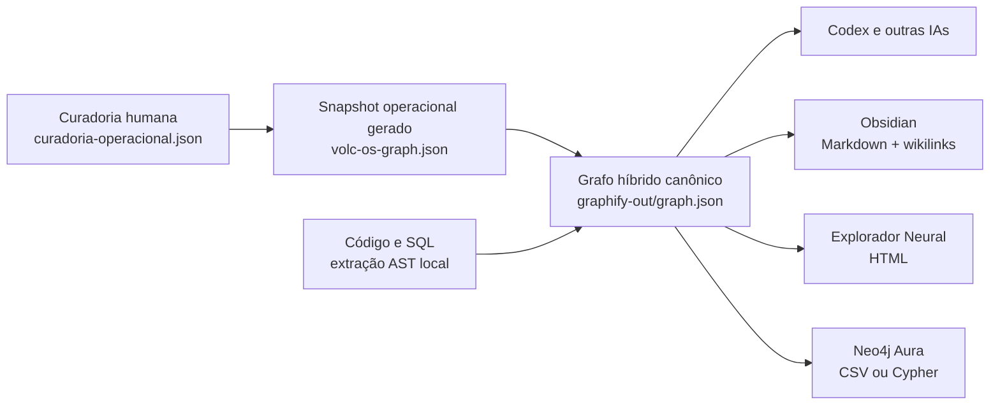

# Mapa Vivo VOLC O.S. · arquitetura permanente

## Resposta curta

O “grafo neural” não é um único desenho. Ele é uma pequena infraestrutura com
fontes, uma fusão canônica e visualizações derivadas. A curadoria humana entra por
um único arquivo editável à mão, `docs/volc-os-graph/curadoria-operacional.json`, e a
referência principal para agentes e consultas é `graphify-out/graph.json`.



## Onde cada coisa mora

A ordem das fontes, do que manda para o que é derivado:

1. **curadoria operacional humana** — `docs/volc-os-graph/curadoria-operacional.json`,
   a única camada editável à mão;
2. **snapshot operacional gerado** — `docs/volc-os-graph/volc-os-graph.json`, saída do
   gerador; editar aqui é perder o trabalho no build seguinte;
3. **extração técnica regenerável** — `.graphify-cache/code/graphify-out/graph.json`,
   nunca autoridade de negócio;
4. **grafo híbrido canônico** — `graphify-out/graph.json`, o que os agentes consultam
   para relações, caminhos e impacto;
5. **exports e visualizações** — Obsidian, GraphML, CSV, Cypher e Explorador Neural,
   derivados e nunca fonte.

| Camada | Caminho | Papel | Pode editar à mão? |
|---|---|---|---|
| Curadoria humana | `docs/volc-os-graph/curadoria-operacional.json` | Capacidades, conceitos, documentos, relações de negócio e prioridades | **Sim — é a única camada que se edita à mão** |
| Snapshot operacional gerado | `docs/volc-os-graph/volc-os-graph.json` | Curadoria já combinada com os snapshots vivos: estados, prioridades e evidências | Não; é regenerado, e a edição se perde |
| AST técnico | `.graphify-cache/code/graphify-out/graph.json` | Código, SQL, imports e chamadas | Não; é regenerado |
| Híbrido canônico | `graphify-out/graph.json` | Ponte entre operação e implementação; referência dos agentes | Não; é fundido pelo pipeline |
| Estado da atualização | `graphify-out/UPDATE_STATUS.json` | Data, commit, hashes e contagens | Não |
| Obsidian | `graphify-out/obsidian-volc-os/` | Visão humana curada em notas conectadas | Não na pasta gerada |
| Explorador | `entregaveis/Explorador_Neural_VOLC_OS.html` | Navegação visual sem instalar nada | Não |
| Intercâmbio | `graphify-out/graph.graphml` | Gephi, yEd e ferramentas GraphML | Não |
| Nuvem | `graphify-out/hybrid-nodes.csv` e `hybrid-edges.csv` | Neo4j Aura Data Importer | Não |
| Banco em grafo | `graphify-out/cypher.txt` | Neo4j e bancos compatíveis com Cypher | Não |

## Qual é a “linguagem” do grafo?

Não existe uma única linguagem:

- **JSON node-link** é a forma canônica. Há listas `nodes` e `links`, compatíveis
  com o modelo de grafo do NetworkX. Cada relação registra tipo, confiança,
  contexto e evidência.
- **GraphML** é o formato aberto em XML para trocar grafos entre ferramentas.
- **Cypher** é a linguagem de consulta/importação da família Neo4j.
- **Markdown com `[[wikilinks]]`** é a forma que o Obsidian entende como rede de
  notas.
- **HTML + JavaScript** é apenas a experiência visual autônoma.

## Como manter atualizado

Atualização completa:

```bash
python3 scripts/atualizar_grafo_volc_os.py
```

Conferência rápida de frescor:

```bash
python3 scripts/atualizar_grafo_volc_os.py --check
```

Atualização com novo inventário somente-leitura do Supabase:

```bash
python3 scripts/atualizar_grafo_volc_os.py --refresh-live
```

O código e o SQL podem se autoalimentar de forma determinística. Já prioridades,
significado de negócio, “isso está realmente vivo?” e decisões de roadmap não
devem ser inventados automaticamente: entram em
`docs/volc-os-graph/curadoria-operacional.json` — nunca na saída gerada — e de lá
passam a alimentar todo o restante.

## Como curar

Curar é editar **um** arquivo: `docs/volc-os-graph/curadoria-operacional.json`. O
gerador o **lê**, valida e combina com os snapshots vivos; ele nunca escreve ali. Há
uma guarda por hash (`_guarda_fonte_humana`) que faz o build falhar se a fonte humana
for tocada durante a geração.

São cinco blocos, e nada além deles:

| Bloco | O que entra |
|---|---|
| `capabilities` | Capacidades do produto, com `cluster`, `state`, `summary` e `evidence` |
| `concepts` | Conceitos, decisões e destinos ainda não implementados |
| `documents` | Documentos de contexto e a capacidade que cada um `documenta` |
| `edges` | Relações de negócio (`source`, `target`, `relation`) que o código não revela |
| `priorities` | Ordem de ataque: `rank`, `state`, o porquê, a prova e os nós envolvidos |

Ao ler, o gerador valida o schema (chaves obrigatórias e campos vazios), os clusters e
os estados contra as listas reconhecidas, IDs duplicados entre blocos e referências
quebradas — arestas e documentos que apontam para nós inexistentes. Qualquer uma
dessas falhas **derruba o build**, com o item e a mensagem, em vez de descartar a
entrada em silêncio: um grafo com referência quebrada mente pior que um grafo
desatualizado.

Isto conserta um defeito real. A curadoria morava numa lista embutida em
`scripts/gerar_grafo_volc_os.py`, enquanto a documentação apontava a saída gerada como
“fonte curada” — quem editava a saída perdia o trabalho no build seguinte, e foi o que
aconteceu em 24/08/2026. A regressão está coberta por
`scripts/tests/test_curadoria_do_grafo.py`, que prova que a curadoria sobrevive ao
rebuild, que erro de curadoria falha alto e que dois builds do mesmo insumo produzem
os mesmos bytes:

```bash
backend/.venv/bin/python -m pytest scripts/tests/test_curadoria_do_grafo.py -q
```

## Como isso vira referência em toda interação

O arquivo `AGENTS.md`, na raiz do projeto, determina que futuras sessões:

1. consultem o grafo antes de responder sobre arquitetura, impacto ou roadmap;
2. usem a camada operacional para estados e prioridades, editando apenas a fonte
   humana e nunca o snapshot gerado;
3. verifiquem `UPDATE_STATUS.json` antes de assumir que a rede está atual;
4. nunca sobrescrevam o híbrido com um `graphify update .` direto;
5. reconstruam tudo pelo pipeline único.

Isso vale para o repositório. O grafo não deve ser colocado como regra global do
computador, pois ele é uma verdade específica do VOLC O.S.

## Obsidian

Para abrir agora, escolha a pasta `graphify-out/obsidian-volc-os/` como um vault,
ou descompacte `entregaveis/VOLC_OS_Obsidian_Vault.zip` em outro local e abra essa
pasta. Comece pela nota `_INICIO` e use o Graph view.

O vault exportado contém apenas os 269 nós operacionais curados. Colocar mais de
9 mil símbolos de código como notas deixaria o Obsidian ruidoso e pouco útil. O
grafo híbrido completo continua disponível no Explorador Neural e no Neo4j.

Se quiser escrever notas próprias, use uma **cópia** do ZIP. A pasta dentro de
`graphify-out` é gerada novamente pelo pipeline.

## Nuvem: recomendação

1. **Agora:** Obsidian local para pensar e navegar; Obsidian Sync com criptografia
   ponta a ponta se precisar dos mesmos mapas em vários dispositivos.
2. **Para o time e o grafo completo:** Neo4j Aura privado. Importe os dois CSVs,
   relacione `source` e `target` ao campo `id`, e use Bloom/Explore para pesquisar,
   expandir vizinhos e consultar caminhos com Cypher.
3. **Para compartilhar apenas a experiência visual:** hospede o Explorador Neural
   atrás de Cloudflare Access com política de acesso explícita. Não publique o HTML
   abertamente: ele contém estrutura do código e metadados operacionais embutidos.

Referências oficiais: [Graph view do Obsidian](https://obsidian.md/help/Plugins/Graph%2Bview),
[segurança do Obsidian Sync](https://obsidian.md/help/sync/security),
[Neo4j Aura](https://neo4j.com/docs/aura/),
[Cloudflare Access](https://developers.cloudflare.com/cloudflare-one/access-controls/applications/http-apps/).
